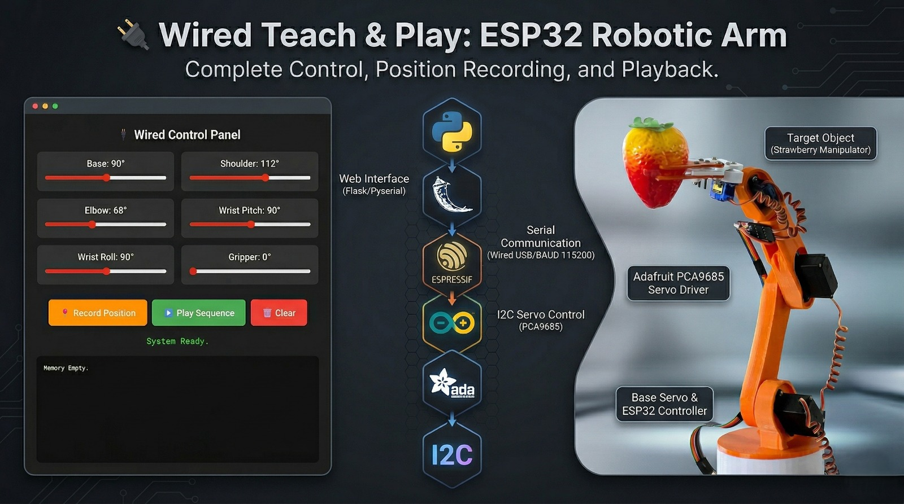

# Tethered Precision Control (USB WebUI)

This module enables high-precision control of the robotic arm via a USB connection. A lightweight Flask web interface allows users to adjust joint angles using sliders in real-time.

## Features
- **Wired Connection**: Reliable, low-latency control via USB Serial.
- **Web UI**: Access the control panel from your browser to manually adjust all 6 robotic joints.
- **Record and Play**: Save custom sequences of movements step-by-step and play them back sequentially.
- **Microcontroller Integration**: Designed to work with the connected `controller.ino` firmware.

## How to Run
1. Upload `controller.ino` to your microcontroller.
2. Ensure the board is connected securely via USB and update `SERIAL_PORT` in `app.py`.
3. Run the Flask server: `python app.py`
4. Open your browser to the local server address (usually `http://localhost:5000`).
