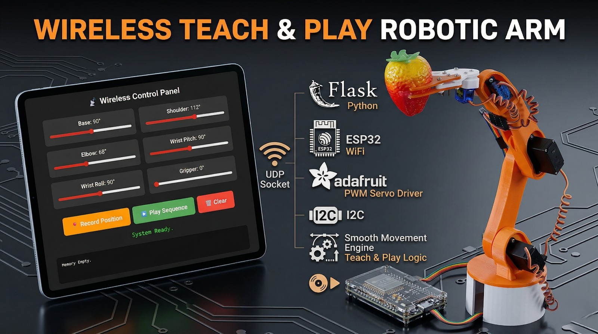

# Wireless Teleoperation (Real-Time Cobot)

This sophisticated teleoperation setup allows one master robotic arm or controller to dictate the movements of a secondary, remote arm instantly over a wireless network.

## Features
- **Real-Time Mimicking**: Watch the secondary cobot mimic actions instantaneously with practically zero latency.
- **Wireless Syncing**: Networked protocol designed for continuous stream of joint data.
- **Telepresence**: Excellent for hazardous environments or remote tasks where direct kinesthetic feedback matters.

## How to Run
1. Upload the respective `controller.ino` firmware to both the master and slave devices.
2. Ensure both are communicating over the designated WiFi channels.
3. Start the host bridge network: `python app.py`
4. Move the master controller/arm to see real-time response on the slave arm.
