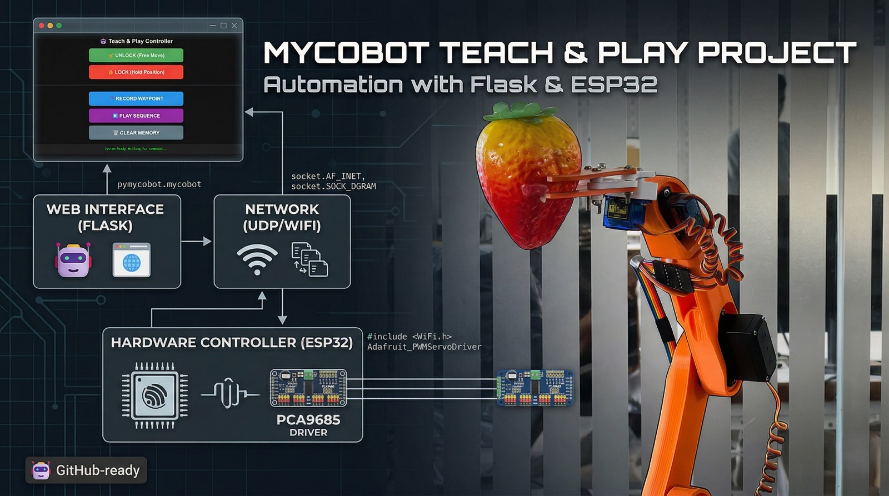

# Kinesthetic Teaching (Record & Play Cobot)

This paradigm focuses on intuitive human-robot interaction where a user physically guides the robotic arm through desired paths to teach it custom sequences.

## Features
- **Physical Guidance**: Directly manipulate the robot's physical joints to naturally teach complex paths.
- **Record & Playback**: Capture kinematic data seamlessly and execute the recorded path with precision.
- **Collaborative Robot (Cobot) Feel**: Emphasizes soft, learnable movements without relying solely on digital UI programming.

## How to Run
1. Deploy `controller.ino` to the robotic arm.
2. Run `python app.py` to start the overarching listener and playback manager.
3. Use the physical teach modes or the web interface to toggle the recording state.
4. Physically guide the arm, save the sequence, and hit play to watch it replicate the movement.
